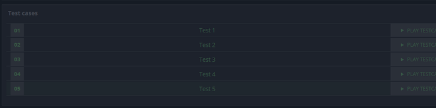
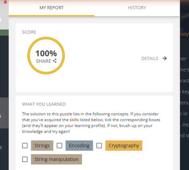
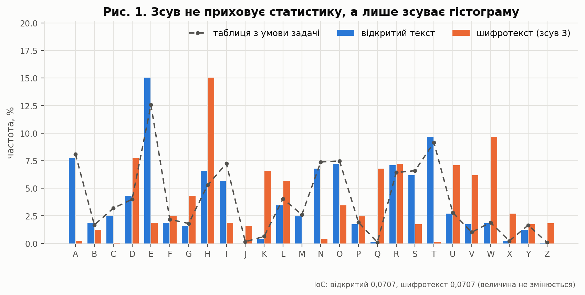
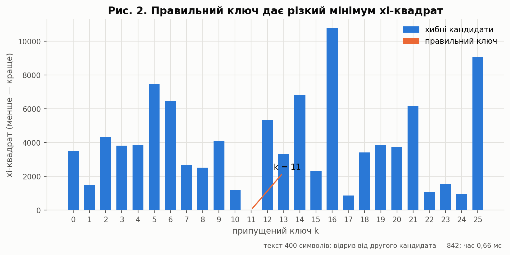
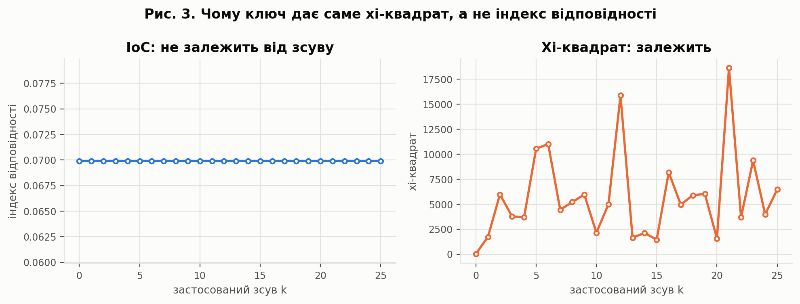
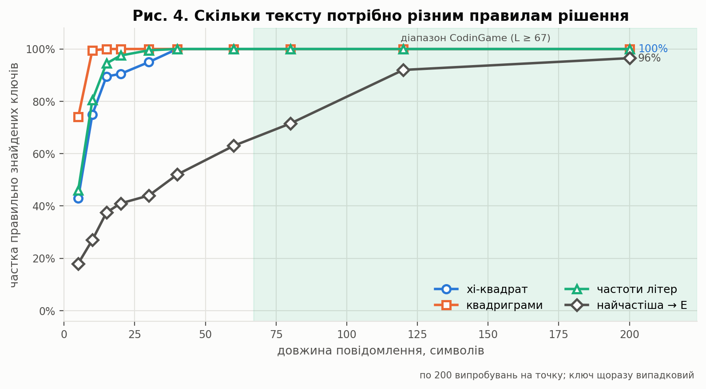
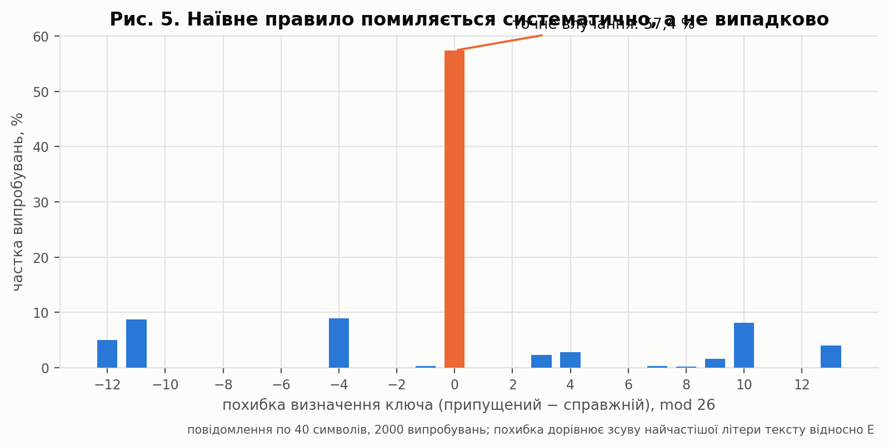
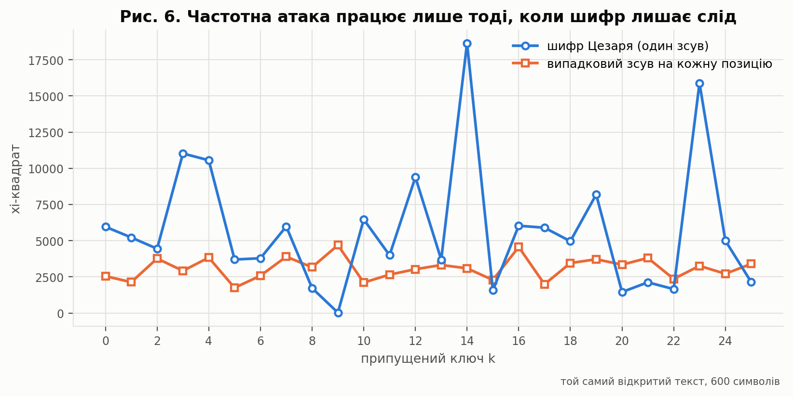

<h1 align="center">Лабораторна робота №3</h1>
<h3 align="center">Злам шифру Цезаря частотним аналізом<br>(без знання ключа)</h3>

<p align="center">
  <a href="https://github.com/RE22GDV/LR3-Frequency/actions/workflows/ci.yml"></a>
  
  
  
  
  
</p>

> **Дисципліна:** Захист даних &nbsp;·&nbsp; **Тема:** частотний аналіз, злам шифру без ключа
> **Задача:** [CodinGame — Frequency-Based Decryption](https://www.codingame.com/training/medium/frequency-based-decryption) (Medium)

---

## Зміст

1. [Мета та постановка задачі](#1-мета-та-постановка-задачі)
2. [Модель шифру та простір ключів](#2-модель-шифру-та-простір-ключів)
3. [Структура репозиторію](#3-структура-репозиторію)
4. [Швидкий старт](#4-швидкий-старт)
5. [Верифікація рішення](#5-верифікація-рішення)
6. [Криптоаналіз](#6-криптоаналіз)
7. [Висновки](#7-висновки)
8. [Відтворення результатів](#8-відтворення-результатів)
9. [Джерела](#9-джерела)

---

## 1. Мета та постановка задачі

**Мета роботи** — на прикладі шифру Цезаря розібратися, як саме статистика
природної мови дозволяє прочитати шифротекст **без ключа**, і кількісно
оцінити, скільки тексту для цього потрібно.

На відміну від попередньої роботи, тут не треба писати шифратор: треба
зламати вже зашифроване повідомлення. Як зазначено в умові лабораторної,
«тільки знаючи, як взламуються шифри, можна писати гарні шифри».

### Постановка (за умовою CodinGame)

```
Вхід    : один рядок — повідомлення, зашифроване зсувом; ключ НЕ надано
Вихід   : один рядок — розшифроване повідомлення
Обмеження: 67 ≤ довжина повідомлення < 1000
```

Додаткові вимоги умови:

* зсув застосовується **лише до літер** — цифри, розділові знаки й пробіли
  лишаються на місці;
* **регістр літер зберігається**;
* еталонні частоти літер англійської мови задано безпосередньо в умові
  (див. `PUZZLE_FREQ` у [`frequencies.py`](src/freqcrack/frequencies.py)).

### Приклад із умови

```
Khoor Zruog ! Frqjudwxodwlrqv, brx kdyh vxffhvvixoob ghfubswhg ph !
     ↓ ключ знайдено частотним аналізом: k = 3
Hello World ! Congratulations, you have successfully decrypted me !
```

> **Термінологічне уточнення.** В умові лабораторної роботи зсув названо
> перестановкою. У строгій класифікації шифрів циклічний зсув є
> **підстановкою** символів: він замінює кожну літеру іншою, але не змінює
> їхніх позицій у повідомленні. Перестановний (транспозиційний) шифр,
> навпаки, переставляє самі символи
> ([HAC, § 1.5.2](https://cacr.uwaterloo.ca/hac/about/chap1.pdf)).
> Надалі для уникнення неоднозначності вживається термін **«зсув Цезаря»**.

---

## 2. Модель шифру та простір ключів

Позначимо літери числами `0..25`. Шифрування та розшифрування:

```
c[i] = (m[i] + k) mod 26      — лише для літер
m[i] = (c[i] − k) mod 26
```

Зсуви утворюють **циклічну групу порядку 26**: послідовне застосування
зсувів `a` і `b` дорівнює одному зсуву `a + b` (перевіряється тестом
[`test_shifts_compose_additively`](tests/test_caesar.py)). Тому нічого не
дає ні багаторазове шифрування, ні «складний» ключ — усе зводиться до
одного числа.

| Величина | Значення |
|---|---:|
| Кількість ключів | **26** |
| Ентропія ключа за рівноймовірного вибору | **4.70 біта** |
| Орієнтовна відстань єдиності (`h ≈ 1.5` біта/символ) | **1.5 символу** |

За оцінки ентропії англійського тексту `h ≈ 1.5` біта/символ надлишковість
мови становить `D = log₂26 − h ≈ 4.70 − 1.50 = 3.20` біта/символ, тому
орієнтовна відстань єдиності дорівнює `n₀ = H(K) / D ≈ 4.70 / 3.20 ≈ 1.47`
символу.

> Відстань єдиності — оцінка в прийнятій моделі мови, а не жорстка межа:
> вона не гарантує ні неможливості зламу коротших повідомлень, ні успіху
> конкретного алгоритму на довших. Наскільки далекою вона є від практики,
> показано в §6.4.

**Головний наслідок такого простору ключів:** через малий простір ключів
практичний злам шифру Цезаря зводиться до **повного перебору 26 можливих
зсувів і вибору найкращого кандидата за статистичним критерієм**.
Перебір тут тривіальний; уся складність — у правилі, яке автоматично
вирішує, який із 26 кандидатів є осмисленим текстом.

---

## 3. Структура репозиторію

```
LR3_Frequency/
├── solution/
│   └── codingame_solution.py      Рішення, відправлене на CodinGame (100 %)
├── src/freqcrack/
│   ├── caesar.py                  Шифр: зсув літер, збереження регістру
│   ├── frequencies.py             Таблиці частот (з умови та Beker & Piper)
│   ├── scoring.py                 Хі-квадрат, IoC, ентропія, відстань єдиності
│   ├── ngrams.py                  Модель англійської мови (квадриграми)
│   ├── breaker.py                 Злам: 26 кандидатів + 4 правила рішення
│   └── cli.py                     Командний інтерфейс
├── csharp/Freq/                   Незалежна реалізація мовою C# (.NET 8)
├── tests/                         102 тести, зокрема 5 офіційних із CodinGame
├── experiments/run_experiments.py Усі обчислювальні експерименти та рисунки
├── tools/build_ngrams.py          Побудова мовної моделі з корпусу
├── data/                          Модель мови + текст для експериментів
└── docs/
    ├── ЛР_3_...РС-61мн.pdf/.docx  Звіт у двох форматах, 16 стор.
    ├── figures/                   Рисунки (+ pdf/ — версії без заголовків)
    └── results/                   experiments.json, summary.md
```

**Ядро й усі правила рішення не мають зовнішніх залежностей** — лише
стандартна бібліотека Python. `matplotlib` і `pytest` потрібні виключно
для графіків і тестів.

---

## 4. Швидкий старт

```bash
git clone https://github.com/RE22GDV/LR3-Frequency.git
cd LR3-Frequency
python run.py selftest
```

```
[OK] Test 1  ключ  3 (істина  3)  Hello World ! Congratulations, you have succ
[OK] Test 2  ключ  8 (істина  8)  I rubbed shoulders with people who spoke of
[OK] Test 3  ключ 10 (істина 10)  You can fool all of the people some of the t
[OK] Test 4  ключ 14 (істина 14)  Any code you've been writing for 6 months or
[OK] Test 5  ключ 24 (істина 24)  Mr. and Mrs. Dursley, of number four, Privet
Пройдено 5 з 5
```

Основні команди:

```bash
python run.py solve < tests/samples/case1.txt    # режим CodinGame
python run.py break --text "Khoor Zruog !"       # злам без ключа
python run.py compare --text "<шифротекст>"      # усі 4 правила рішення
python run.py analyze --text "<текст>"           # частоти, IoC, ентропія
python run.py tables                             # порівняння таблиць частот
python run.py keyspace                           # простір ключів
```

Реалізація мовою C#:

```bash
dotnet run --project csharp/Freq -- selftest
```

---

## 5. Верифікація рішення

### 5.1 Офіційні валідатори CodinGame

| Показник | Значення |
|---|---|
| **Оцінка валідаторів** | **100 %** |
| Мова | Python 3 |
| Видимі тести | 5 з 5 |
| Відправлений код | [`solution/codingame_solution.py`](solution/codingame_solution.py) — виконуваний код збігається з надісланим посимвольно; у репозиторії до нього додано лише заголовний коментар |





### 5.2 Офіційні тести в репозиторії

Входи та еталонні виходи всіх п'яти тестів збережено в
[`tests/official_cases.json`](tests/official_cases.json). Окремий тест
`test_fixture_is_self_consistent` перевіряє, що записаний ключ точно
перетворює очікуваний відкритий текст на збережений шифротекст — це ловить
будь-яку помилку переписування тестових даних.

| № | Ключ | Довжина | Результат |
|---|---:|---:|:-:|
| 1 | 3 | 93 | ✅ |
| 2 | 8 | 227 | ✅ |
| 3 | 10 | 142 | ✅ |
| 4 | 14 | 119 | ✅ |
| 5 | 24 | 923 | ✅ |

У п'яти тестах — п'ять різних ключів, тож «вгадати один зсув» не вийде.
П'ятий тест окремо перевіряє збереження типографського апострофа `’`
(U+2019) та інших нелітерних символів.

### 5.3 Властивісні тести

102 тести, серед них:

- **оборотність** — `decrypt(encrypt(m, k), k) == m` на 500 випадкових рядках;
- **група зсувів** — `E_a ∘ E_b = E_{a+b}` на 50 випадкових парах;
- **нелітерні символи недоторкані** — цифри, розділові знаки, `’`, кирилиця, табуляція;
- **регістр зберігається** — посимвольна перевірка;
- **IoC інваріантний щодо зсуву**, а хі-квадрат — ні (ключова пара тестів, §6.3);
- **наївне правило помиляється систематично** — перевіряється формула
  похибки для випадку, коли максимум гістограми єдиний.

### 5.4 Перехресна перевірка двох реалізацій

Незалежна реалізація мовою **C#** відновлює ті самі відкриті тексти;
тест [`test_python_and_csharp_break_identically`](tests/test_cross_implementation.py)
порівнює результати обох реалізацій символ у символ.

```bash
$ python -m pytest -q
102 passed
```

---

## 6. Криптоаналіз

Усі числа й рисунки отримано скриптом
[`experiments/run_experiments.py`](experiments/run_experiments.py).

**Дані експериментів.** Фрагменти відкритого тексту нарізаються з файлу
[`data/sample_plaintext.txt`](data/sample_plaintext.txt) — суцільного
англійського тексту обсягом 2 501 байт (2 497 символів після нормалізації
пробілів; лише літери `A..Z`, пробіли й розділові знаки), з якого перед
нарізанням прибрано розбиття на рядки. Статистику квадриграм узято з
окремого, значно більшого корпусу: вісім книжок суспільного надбання з
Project Gutenberg, зведених до послідовності літер `A..Z` (юридичну
«обгортку» Gutenberg відкинуто), разом **5 623 458 літер**; збережено
4-грами з частотою ≥ 3, усього 54 626 записів — див.
[`tools/build_ngrams.py`](tools/build_ngrams.py) і
`data/english_quadgrams.txt.gz`. Зерна генераторів фіксовані
(`20260923` — §6.4, `4242` — §6.5, `77` — §6.6), тому весь прогін
відтворюється число в число.

### 6.1 Що зсув робить із частотами



Це головна відмінність від попередньої роботи. Інкрементний зсув Енігми
**вирівнював** частоти; тут же фіксований зсув лише **обертає гістограму
на `k` позицій**, не змінюючи її форми:

| Величина | Відкритий текст | Шифротекст (k = 3) |
|---|---:|---:|
| Найчастіша літера | **E** | **H** = E + 3 |
| Індекс відповідності | 0.0707 | **0.0707** (не змінився) |
| Хі-квадрат до таблиці з умови | 54 | **15 896** |

Форма розподілу вціліла повністю — саме тому шифр і зламний. Зсув піку
гістограми точно дорівнює ключу (перевіряється в експерименті).

### 6.2 Профіль хі-квадрат по 26 кандидатах



Перебираємо всі 26 ключів і для кожного кандидата рахуємо

```
χ²(k) = Σ (спостережено − очікувано)² / очікувано
```

Правильний ключ дає різкий мінімум: для тексту з 400 символів найкращий
кандидат у **37 разів** кращий за другого, а весь перебір триває **0.7 мс**.

Гістограма будується один раз і далі циклічно зсувається, а сам текст
розшифровується теж один раз — уже відомим ключем. Тому складність
надісланого розв'язку — **O(L + 26²)** за часом при **O(26)** додаткової
пам'яті; оскільки 26 — константа, асимптотично це **O(L)**.

### 6.3 Чому ключ дає саме хі-квадрат, а не індекс відповідності



Це теоретично найцікавіше місце роботи. Дві метрики поводяться протилежно:

| Метрика | Поведінка при зсуві | Що показує |
|---|---|---|
| Індекс відповідності | **не змінюється взагалі** (розкид 0.0 по всіх 26 зсувах) | нічого про ключ |
| Хі-квадрат | змінюється у **744 рази** (від 25 до 18 642) | *ключ* |

Причина проста: зсув лише переставляє стовпчики гістограми, а IoC залежить
тільки від їхнього набору, не від порядку. Отже, індекс відповідності
**інваріантний щодо зсуву Цезаря**, тому не дає змоги визначити ключ.
Водночас його значення лишається статистичною характеристикою розподілу
символів і використовується в криптоаналізі як допоміжний показник —
зокрема, у §6.6 його значення для шифротексту наближається до значення,
характерного для рівномірного розподілу. Хі-квадрат же порівнює гістограму з **конкретним** еталоном,
і тому ключ знаходить.

### 6.4 Скільки тексту потрібно різним правилам рішення



Порівняно чотири правила на 200 випробуваннях для кожної довжини
(ключ щоразу випадковий):

| Правило рішення | 5 | 10 | 15 | 20 | 40 | 120 | 200 |
|---|---:|---:|---:|---:|---:|---:|---:|
| квадриграми | 74.0 | 99.5 | **100** | 100 | 100 | 100 | 100 |
| частоти літер | 46.0 | 80.5 | 94.5 | 97.5 | **100** | 100 | 100 |
| хі-квадрат | 43.0 | 75.0 | 89.5 | 90.5 | **100** | 100 | 100 |
| найчастіша → E | 18.0 | 27.0 | 37.5 | 41.0 | 52.0 | 92.0 | 96.5 |

*Частка правильно знайдених ключів, %. Це результати саме цієї серії
випробувань на вказаному корпусі та параметрах.*

Що з цього випливає:

- **квадриграми** виграють на коротких текстах, бо враховують ще й порядок
  літер, а не лише їхні частоти: 100 % уже з 15 символів у цій серії;
- **хі-квадрат** і **частоти літер** досягли 100 % із 40 символів;
- **наївне правило** «найчастіша літера → E» не досягло 100 % навіть на
  200 символах.

Порівняння з теорією: відстань єдиності для 26 ключів становить лише
**1.5 символу**, тобто інформації в принципі вистачає майже одразу. Реальні
ж 15–40 символів — це розрив між інформаційно-теоретичною оцінкою та
можливостями конкретного вирішального правила.

> **Наслідок для умови задачі.** Мінімальна довжина повідомлення,
> передбачена умовою задачі, `L ≥ 67`, суттєво перевищує довжини, на яких
> у проведеній серії випробувань усі три статистичні правила досягли 100 %
> правильних визначень ключа. Саме тому надісланий розв'язок із простим
> хі-квадратом проходить валідатори.

### 6.5 Чому наївне правило помиляється



Правило «найчастіша літера шифротексту відповідає E» помиляється
**систематично, а не випадково**: його похибка безпосередньо пов'язана зі
зсувом найчастішої літери *відкритого* тексту відносно E.

На повідомленнях по 40 символів (2000 випробувань) найчастішою літерою
тексту виявилася:

| Літера | E | A | O | решта |
|---|---:|---:|---:|---:|
| Частка випробувань | 61.4 % | 12.3 % | 6.6 % | ≈ 19.7 % |

Точність правила — **57.4 %**. Розрив із часткою випадків, коли найчастішою
справді була E (61.4 %), пояснюється **нічиями за максимумом** і правилом
їх розв'язання. На фрагментах по 40 символів лічильники малі, тому в
**23.4 %** випробувань максимум гістограми досягався одразу на кількох
літерах; `max()` розв'язує таку нічию на користь меншого індексу, а
циклічний зсув цього вибору не зберігає. Відповідно:

| Випадок | Частка випробувань | Виконання формули похибки | Точність правила |
|---|---:|---:|---:|
| максимум єдиний | 76.7 % (1533) | **1533 із 1533** | 65.1 % |
| є нічия за максимумом | 23.4 % (467) | не гарантовано | 32.1 % |

Тобто формула «похибка = зсув найчастішої літери тексту відносно E» точна
**за умови, що максимум єдиний** — там вона не дала жодного винятку; усі
94 випробування, у яких найчастішою літерою тексту була E, а ключ усе ж
не вгадано, — це випадки з нічиєю.

Висновок методичний: правило спирається рівно на одне спостереження, тоді
як хі-квадрат використовує всі 26 і тому стійкіший до коливань коротких
вибірок.

### 6.6 Коли частотна атака не працює



У постановці лабораторної роботи є пряма вимога: «шифрограми мають бути
без статистичних закономірностей, які притаманні звичайному тексту».
Перевіримо її експериментально, зашифрувавши **той самий** відкритий текст
двома способами:

| Шифр | Мін. χ² | Макс. χ² | Контраст | IoC шифротексту |
|---|---:|---:|---:|---:|
| Цезар (один зсув) | 25 | 18 642 | **744×** | 0.0699 |
| Випадковий зсув на кожну позицію | 1 743 | 4 690 | **2.7×** | 0.0392 |

У другому випадку профіль χ² майже плаский — жоден кандидат не виділяється,
а IoC падає до значення рівномірного розподілу (0.0385). Частотна атака
перестає працювати не тому, що стала «складнішою», а тому, що в шифротексті
не лишилося сліду, за який вона чіплялася.

Це не є пропозицією практичної схеми: для незалежного випадкового зсуву
кожної літери ключова послідовність повинна мати довжину, порівнянну з
довжиною повідомлення, та безпечно передаватися одержувачу — фактично це
вже наближення до ідеї одноразового ключа. Демонстрація показує лише те,
на чому саме тримається частотний аналіз.

---

## 7. Висновки

1. **Задачу розв'язано повністю**: пройдено 5 видимих тестів CodinGame,
   підсумкова оцінка прихованих валідаторів — **100 %**. Реалізацію
   продубльовано двома мовами (Python і C#) і покрито **102 тестами**.

2. **Через малий простір ключів практичний злам шифру Цезаря зводиться
   до повного перебору 26 можливих зсувів і вибору найкращого кандидата
   за статистичним критерієм.** Простір ключів містить 26 варіантів
   (ентропія 4.70 біта), тому перебір тривіальний; уся складність — у
   правилі, яке автоматично впізнає осмислений текст.

3. **Зсув зберігає форму частотного розподілу**, лише обертаючи гістограму
   на `k` позицій. Індекс відповідності при цьому не змінюється взагалі,
   а хі-квадрат — у сотні разів. Саме ця різниця пояснює, чому ключ дає
   хі-квадрат: індекс відповідності інваріантний щодо зсуву й тому не
   містить інформації про конкретне значення зсуву.

4. **Правила рішення істотно різняться за вимогами до обсягу тексту.**
   У проведеній серії квадриграми досягли 100 % із 15 символів,
   хі-квадрат і частоти літер — із 40, а наївне правило «найчастіша → E»
   не досягло 100 % навіть на 200 символах.

5. **Наївне правило помиляється систематично**: якщо максимум гістограми
   єдиний, його похибка дорівнює зсуву найчастішої літери відкритого
   тексту відносно E, тому його точність (57.4 % на 40 символах)
   близька до частки текстів, у яких
   найчастішою літерою справді є E (61.4 %); залишковий розрив дають
   нічиї за максимумом гістограми, які трапилися у 23.4 % випробувань.
   Формула похибки виконалася в усіх 1533 випробуваннях з єдиним
   максимумом без жодного винятку.

6. **Вимога умови про відсутність статистичних закономірностей
   підтверджується вимірюванням.** Для шифру Цезаря контраст між
   найкращим і найгіршим кандидатом значення хі-квадрат відрізнялися
   приблизно у 744 рази, для шифру з випадковим зсувом на кожну
   позицію — лише у 2.7 раза, і атака перестала розрізняти кандидатів.

7. **Практичний урок:** для розглянутих класичних шифрів важливим
   чинником стійкості до частотного аналізу є те, наскільки шифротекст
   зберігає статистичні закономірності відкритого тексту.

---

## 8. Відтворення результатів

```bash
# 1. Тести (102 шт.)
python -m pytest -q

# 2. Офіційні тести CodinGame
python run.py selftest
dotnet run --project csharp/Freq -- selftest

# 3. Усі експерименти, числа та рисунки (кілька секунд)
pip install -r requirements.txt
python experiments/run_experiments.py
#   -> docs/figures/*.png
#   -> docs/results/experiments.json, summary.md

# 4. Перебудова мовної моделі з корпусу (потрібен інтернет; результат уже в data/)
python tools/build_ngrams.py
```

Усі генератори псевдовипадкових чисел ініціалізуються фіксованими зернами,
тому повторний запуск дає ті самі числа.

---

## 9. Джерела

1. CodinGame. *Frequency-Based Decryption* [Електронний ресурс]. – Режим
   доступу: https://www.codingame.com/training/medium/frequency-based-decryption
2. Caesar cipher [Електронний ресурс] // Wikipedia. – Режим доступу:
   https://en.wikipedia.org/wiki/Caesar_cipher
3. Frequency analysis [Електронний ресурс] // Wikipedia. – Режим доступу:
   https://en.wikipedia.org/wiki/Frequency_analysis
4. Index of coincidence [Електронний ресурс] // Wikipedia. – Режим доступу:
   https://en.wikipedia.org/wiki/Index_of_coincidence
5. Menezes A., van Oorschot P., Vanstone S. *Handbook of Applied
   Cryptography*, § 1.5. – CRC Press, 1996. – Режим доступу:
   https://cacr.uwaterloo.ca/hac/about/chap1.pdf
6. Shannon C. E. Communication Theory of Secrecy Systems // Bell System
   Technical Journal. – 1949. – Vol. 28, No. 4. – P. 656–715.
7. Beker H., Piper F. *Cipher Systems: The Protection of Communications*. –
   London: Northwood Books, 1982. – 436 p.
8. Project Gutenberg [Електронний ресурс]. – Режим доступу:
   https://www.gutenberg.org/ (перелік восьми книжок, з яких побудовано
   модель квадриграм, наведено у [`tools/build_ngrams.py`](tools/build_ngrams.py))
9. Вихідний код роботи [Електронний ресурс]. – Режим доступу:
   https://github.com/RE22GDV/LR3-Frequency

---

<p align="center">
  <sub>Лабораторна робота №3 · Захист даних · 2026</sub>
</p>
